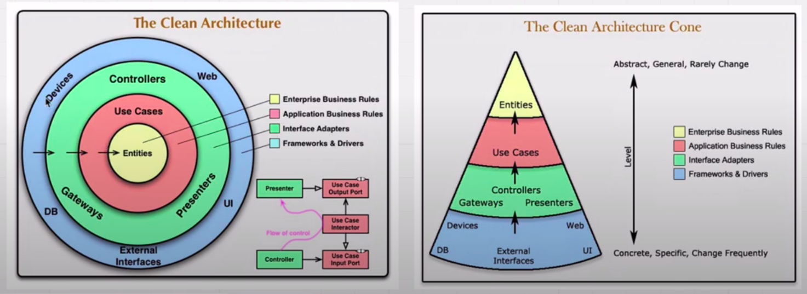
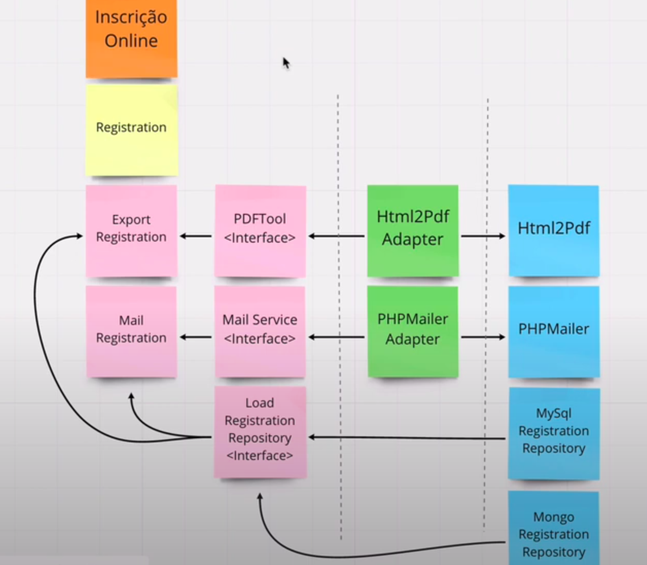

# Clean Architecture

A ideia deste repositório é praticar os conceitos da Clean Architecture de um modo divertido e prático!

## Pré-Requisitos

- PHP 8.1 ou superior;
- [Composer](https://getcomposer.org);
- [Docker](https://www.docker.com);

## Desenho Da Estrutura

[//]: # (# Camadas e Decisões)

[//]: # ()
[//]: # (## Domain | Entities &#40;Camada Amarela&#41;)

[//]: # ()
[//]: # (Definição do autor:)

[//]: # ()
[//]: # (> As Entidades reúnem as **Regras Cruciais de Negócios** da empresa inteira. Uma entidade pode ser um objeto com métodos ou um conjunto de estruturas de dados e funções. Isso não importa, contanto que as entidades possam ser usadas por muitas aplicações diferentes na empresa e são os objetos de negócios da aplicação.)

[//]: # (>)

[//]: # (> Elas concentram as regras mais gerais e de nível mais alto. No mínimo, são propensas a mudar quando ocorrer alguma mudança externa. Por exemplo, você não gostaria que esses objetos fossem impactados por uma mudança na navegação de página ou na segurança. Nenhuma mudança operacional em qualquer aplicação específica deve influenciar a camada da entidade.)

[//]: # (>)

[//]: # (> *Fonte: Clean Architecture Book &#40;Página 204&#41;*)

[//]: # (Uma prática que utilizei aqui é que toda Entity deverá ter sua própria Factory, pois não se sabe como as entitdades podem ser criadas no futuro. As factories nos permite ter essa flexibilidade.)

[//]: # ()
[//]: # (Um exemplo prático pode ser visto no [BattleFactory]&#40;src/Battle/Domain/Factory/BattleFactory.php&#41;.)

[//]: # ()
[//]: # (## Use Cases &#40;Camada Vermelha&#41;)

[//]: # ()
[//]: # (Definição do autor:)

[//]: # ()
[//]: # (> O software da camada de casos de uso contém as **regras de negócio específicas** da aplicação. Ele reúne e implementa todos os casos de uso do sistema. Esses casos de uso orquestram o fluxo de dados para e a partir das entidades e orientam essas entidades na aplicação das Regras Cruciais de Negócios a fim de atingir os objetivos do caso de uso.)

[//]: # (>)

[//]: # (> Não queremos que as mudanças nessa camada afetem as entidades. Também não queremos que essa camada seja afetada por mudanças em externalidades como a base de dados, a UI ou qualquer framework comum. A camada de casos de uso deve ser isolada dessas preocupações. Contudo, esperamos que mudanças na operação da aplicação afetem os casos de uso e, portanto, o software dessa camada.)

[//]: # (>)

[//]: # (> *Fonte: Clean Architecture Book &#40;Página 204&#41;*)

[//]: # (Os use cases são separados por suas respectivas pastas e devem ter pelo menos 3 classes:)

[//]: # ()
[//]: # (- `UseCase.php`: classe principal onde será implementado o caso de uso;)

[//]: # (- `InputBoundary.php`: um [DTO]&#40;https://pt.wikipedia.org/wiki/Objeto_de_Transfer%C3%AAncia_de_Dados&#41; que representa os dados que serão passados para o caso de uso;)

[//]: # (- `OutputBoundary.php`: um [DTO]&#40;https://pt.wikipedia.org/wiki/Objeto_de_Transfer%C3%AAncia_de_Dados&#41; que representa os dados de saída que o caso de uso deverá retornar;)

[//]: # ()
[//]: # (Dentro dessa camada também terá os contratos necessários para que as camadas mais externas possam se comunicar com esta.)

[//]: # ()
[//]: # (## Adapters | Interface Adapters &#40;Camada Verde&#41;)

[//]: # ()
[//]: # (Definição do autor:)

[//]: # ()
[//]: # (> O software da camada de adaptadores de interface consiste em um conjunto de adaptadores que **convertem dados no formato que é mais conveniente para os casos de uso e entidades**, para o formato mais conveniente para algum agente externo como a base de dados ou a web.)

[//]: # (>)

[//]: # (>  Os apresentadores &#40;Presenters&#41;, visualizações e controladores &#40;Controllers&#41; pertencem à camada de adaptadores de interface. Os modelos provavelmente são apenas estruturas de dados transmitidas dos controladores para os casos de uso e, então, dos casos de uso para os apresentadores e visualizações.)

[//]: # (>)

[//]: # (> De maneira similar, os dados dessa camada são convertidos da forma mais conveniente para entidades e casos de uso para a forma mais conveniente para o framework de persistência em uso &#40;por exemplo, a base de dados&#41;.Nenhum código interno desse círculo deve saber nada sobre a base de dados.)

[//]: # (>)

[//]: # (> Fluxo do controle: ele começa no controlador &#40;Controller&#41;, passa pelo caso de uso &#40;Use Case&#41; e, então, acaba sendo executado no apresentador &#40;Presenter&#41;.)

[//]: # (>)

[//]: # (> *Fonte: Clean Architecture Book &#40;Página 205&#41;*)

[//]: # (Nessa camada estarão as implementações e adaptações necessárias para que a camada de Use Cases e Entities possam se comunicar com o mundo externo.)

[//]: # ()
[//]: # (## Infra | Frameworks and Drivers &#40;Camada Azul&#41;)

[//]: # ()
[//]: # (Definição do autor:)

[//]: # ()
[//]: # (> A camada mais externa e é geralmente composta de frameworks e ferramentas como a base de dados e o framework web. Em geral, você não programa muita coisa nessa camada além do código de associação que estabelece uma comunicação com o círculo interno seguinte.)

[//]: # (>)

[//]: # (> Todos os detalhes ficam na camada de frameworks e drivers. A web é um detalhe. A base de dados é um detalhe. Mantemos essas coisas do lado de fora, onde não podem fazer mal nenhum.)

[//]: # (>)

[//]: # (> *Fonte: Clean Architecture Book &#40;Página 205&#41;*)

[//]: # (Aqui terão as classes que farão acesso ao mundo externo: Frameworks, bibliotecas, UI, WEB, CLI e etc.)

[//]: # ()
[//]: # (## Referências e Links)

[//]: # ()
[//]: # (- [Introdução a Arquitetura de Software]&#40;https://blog.taller.net.br/introducao-a-arquitetura-de-software&#41;)

[//]: # (- [Clean Architecture I – Overview]&#40;https://blog.taller.net.br/clean-architecture-overview&#41;)

[//]: # (- [erandirjunior/vehicle-backend]&#40;https://github.com/erandirjunior/vehicle-backend&#41;)

[//]: # (- [erandirjunior/fortbrasil-backend]&#40;https://github.com/erandirjunior/fortbrasil-backend&#41;)

[//]: # (- [rmanguinho/clean-ranking-loader]&#40;https://github.com/rmanguinho/clean-ranking-loader&#41;)

[//]: # (- [In Clean Architecture, where to put validation logic?]&#40;https://ikenox.info/blog/where-to-put-validation-in-clean-architecture/#:~:text=Just%20as%20Clean%20Architecture%20splits,differrent%20depending%20on%20its%20context.&#41;)

[//]: # (- [REST, GraphQL, Clean Architecture e TypeScript com Rodrigo Manguinho // Live #69]&#40;https://www.youtube.com/watch?v=P0gpCCA8ZPs&#41;)

